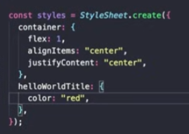

# 📱 React Native — Basics

> A quick-reference guide to understanding the Expo project structure and core React Native components.

---

## 📁 Project Structure

| File / Folder | Purpose |
|---|---|
| `tsconfig.json` | TypeScript configuration — just like in a standard React project |
| `package.json` | Lists and manages all project libraries and dependencies |
| `app.json` | App-level config — favicon, version info, build outputs |
| `assets/` | Store all images, fonts, and static media files here |
| `node_modules/` | Auto-generated folder containing all installed packages |
| `scripts/` | Utility scripts, including the project reset script |
| `components/` | Reusable UI pieces — buttons, cards, modals, etc. |
| `constants/` | App-wide constants such as theme colors and typography |
| `hooks/` | Custom React hooks for shared stateful logic |

> 💡 **Expo** uses a **file-based routing system** — each file inside the `app/` directory automatically becomes a route.

---

## 🚀 First-Time Experiences

Getting familiar with the default Expo project layout:

1. **`index.tsx`** — The very first screen displayed to the user on app launch.
2. **`explore.tsx`** — The second tab / navigation screen shown in the default template.
3. **`_layout.tsx`** — Controls how screens are arranged; defines the navbar, navigation structure, and overall layout.
4. **`app/(tabs)/`** — The directory that defines tab-based navigation in the app.
5. **Reset the project** — To wipe the default template and start fresh:
   ```bash
   cd your-project-name
   npm run reset-project
   ```

---

## 🧩 Core Components

React Native uses its own set of built-in components instead of HTML elements.

### `<View>`
Works like a `<div>` in web development — used for layout and grouping elements.

```tsx
<View style={{ flex: 1, alignItems: 'center' }}>
  {/* child components go here */}
</View>
```

---

### `<Text>`
All visible text **must** be wrapped inside a `<Text>` tag.

```tsx
<Text style={{ fontSize: 18, fontWeight: 'bold' }}>
  Hello, React Native!
</Text>
```

---

### Styling
React Native uses JavaScript-based styles via `StyleSheet.create()`.



```tsx
import { StyleSheet } from 'react-native';

const styles = StyleSheet.create({
  container: {
    flex: 1,
    backgroundColor: '#fff',
    alignItems: 'center',
    justifyContent: 'center',
  },
});
```

---

### `<Image>` (via Expo)
Use the `expo-image` package for optimized image rendering.

```tsx
import { Image } from 'expo-image';

<Image
  source={{
    uri: 'https://i0.wp.com/www.dogwonder.co.uk/wp-content/uploads/2009/12/tumblr_ku2pvuJkJG1qz9qooo1_r1_400.gif?resize=320%2C320',
  }}
  style={{ width: 200, height: 200 }}
/>
```

---

## 🔗 Navigation with Expo Router

Expo Router provides several ways to navigate between screens.

### `<Link>` Component
The `<Link>` component works like an anchor tag — it navigates to a route on press.

```tsx
import { Link } from "expo-router";

<Link href="/about">Go to About</Link>
```

---

### `_layout.tsx` — Stack Navigator
`_layout.tsx` defines the **header and navigation structure** of your screens. It controls animations, header styles, and which screens are included in the stack.

```tsx
import { Stack } from "expo-router";

export default function RootLayout() {
  return (
    <Stack
      screenOptions={{
        headerStyle: { backgroundColor: "#6200EE" },
        headerTintColor: "white",
        animation: "slide_from_right",
      }}
    >
      <Stack.Screen name="index" options={{ headerShown: true, title: "Home" }} />
      <Stack.Screen name="about" options={{ headerShown: true, title: "About" }} />
    </Stack>
  );
}
```

> 💡 **Stack** keeps a navigation history — pressing back returns to the previous screen.

---

### `useRouter()` Hook
`useRouter()` lets you navigate programmatically from any component, e.g. on a button press.

```tsx
import { useRouter } from "expo-router";

const router = useRouter();

// Navigate to a screen
router.push("/about");

// Go back to the previous screen
router.back();

// Replace current screen (no back history)
router.replace("/home");
```

---

### Button Navigation

```tsx
import { Button } from "react-native";
import { useRouter } from "expo-router";

const router = useRouter();

<Button title="Go to About" onPress={() => router.push("/about")} />
```

---

## 🗂️ Tab Navigator

Tabs provide a **bottom navigation bar** with icons. Here's how to set it up:

1. Create a `(tabs)/` folder inside `app/` and move all tab screen files there.
2. In the root `_layout.tsx`, add a single `Stack.Screen` pointing to `(tabs)`.
3. Create a separate `_layout.tsx` inside `(tabs)/` for the tab configuration.

```tsx
import { Tabs } from "expo-router";
import { Ionicons } from "@expo/vector-icons";

export default function TabsLayout() {
  return (
    <Tabs screenOptions={{ tabBarActiveTintColor: "crimson" }}>
      <Tabs.Screen
        name="index"
        options={{
          title: "Home",
          tabBarIcon: ({ color, focused }) => (
            <Ionicons name={focused ? "home" : "home-outline"} size={24} color={color} />
          ),
        }}
      />
      <Tabs.Screen
        name="about"
        options={{
          title: "About",
          tabBarIcon: ({ color, focused }) => (
            <Ionicons
              name={focused ? "information-circle" : "information-circle-outline"}
              size={24}
              color={color}
            />
          ),
        }}
      />
      <Tabs.Screen
        name="profile"
        options={{
          title: "Profile",
          tabBarIcon: ({ color, focused }) => (
            <Ionicons name={focused ? "person" : "person-outline"} size={24} color={color} />
          ),
        }}
      />
    </Tabs>
  );
}
```

---

## 🎨 Expo UI Library (Native Components)

`@expo/ui` provides **truly native UI components** backed by Jetpack Compose (Android) and SwiftUI (iOS). It requires a **development build** — it does not work in Expo Go.

### Setup Steps

1. **Install the package**
   ```bash
   npx expo install @expo/ui
   ```

2. **Configure NDK in `app.json`**
   ```json
   {
     "expo": {
       "android": {
         "package": "com.yourname.appname"
       }
     }
   }
   ```

3. **Prebuild the native project**
   ```bash
   npx expo prebuild
   ```

4. **Run on emulator** *(installs NDK and compiles native code — takes a while the first time)*
   ```bash
   npx expo run:android
   ```

5. **Run on a real device** *(via EAS cloud build)*
   ```bash
   eas build --platform android
   ```

6. **Start the dev server** *(after initial build — hot reload works normally)*
   ```bash
   npx expo start
   ```

### Using the Button Component

> ⚠️ Every `@expo/ui` component **must** be wrapped in a `<Host>` component, and `Host` needs explicit `width` and `height` to be visible.

```tsx
import { View, StyleSheet } from "react-native";
import { Host, Button } from "@expo/ui/jetpack-compose";
import { useRouter } from "expo-router";

export default function Index() {
  const router = useRouter();

  return (
    <View style={styles.container}>
      <Host style={{ width: 200, height: 60 }}>
        <Button
          variant="elevated"   // "elevated" | "outlined"
          onPress={() => router.push("/profile")}
        >
          Go to Profile
        </Button>
      </Host>
    </View>
  );
}

const styles = StyleSheet.create({
  container: { flex: 1, justifyContent: "center", alignItems: "center" },
});
```

---

## ⬆️ Modal Bottom Sheet (Expo UI)

Using `@expo/ui`’s Jetpack Compose components, you can show a **native Android modal bottom sheet**.

> ⚠️ Works only in a **development build**, not in Expo Go.

```tsx
import React, { useState } from "react";
import { View, StyleSheet } from "react-native";
import { Host, Button, ModalBottomSheet, Column, Text } from "@expo/ui/jetpack-compose";
import { paddingAll } from "@expo/ui/jetpack-compose/modifiers";

export default function Profile() {
  const [isBottomSheetOpen, setIsBottomSheetOpen] = useState(false);

  return (
    <View style={styles.container}>
      <Host matchContents>
        <Button variant="elevated" onPress={() => setIsBottomSheetOpen(true)}>
          Open Bottom Sheet
        </Button>

        {isBottomSheetOpen && (
          <ModalBottomSheet onDismissRequest={() => setIsBottomSheetOpen(false)}>
            <Column
              verticalArrangement={{ spacedBy: 12 }}
              modifiers={[paddingAll(24)]}
            >
              <Text>Profile</Text>
              <Text>This is the content of the bottom sheet.</Text>
              <Button onPress={() => setIsBottomSheetOpen(false)}>
                Close
              </Button>
            </Column>
          </ModalBottomSheet>
        )}
      </Host>
    </View>
  );
}

const styles = StyleSheet.create({
  container: { flex: 1, justifyContent: "center", alignItems: "center" },
});
```

> 💡 `onDismissRequest` is called when the user swipes the sheet down or taps outside it — that’s where you close it by updating state.

---

## 🎨 Color Picker with `Picker`

You can use the `Picker` component from `@expo/ui/jetpack-compose` as a simple **color picker** and bind it to text styling.

```tsx
import React, { useState } from "react";
import { View, StyleSheet } from "react-native";
import { Host, Picker, Text } from "@expo/ui/jetpack-compose";

export default function ColorPickerExample() {
  const [selectedIndex, setSelectedIndex] = useState(0);

  const colorLabels = ["Red", "Orange", "Green", "Blue"];
  const colorValues = ["red", "orange", "green", "blue"];

  return (
    <View style={styles.container}>
      <Host matchContents>
        <Picker
          options={colorLabels}
          selectedIndex={selectedIndex}
          onOptionSelected={({ nativeEvent: { index } }) => {
            setSelectedIndex(index);
          }}
          variant="segmented"
          color="#6200EE"
        />

        <Text color={colorValues[selectedIndex]}>
          Profile
        </Text>
      </Host>
    </View>
  );
}

const styles = StyleSheet.create({
  container: { flex: 1, justifyContent: "center", alignItems: "center" },
});
```

> 🧠 Idea: Try binding the picker to other props (like background color) to build interactive theme demos.

---

## 🧠 Platform-Specific Logic

React Native lets you run **platform-specific code** using the `Platform` API.

```tsx
import { Platform, Text, View } from "react-native";

export default function PlatformExample() {
  const message =
    Platform.OS === "ios"
      ? "Running on iOS 🍎"
      : "Running on Android 🤖";

  return (
    <View>
      <Text>{message}</Text>
      {Platform.OS === "android" && (
        <Text>This text only appears on Android.</Text>
      )}
    </View>
  );
}
```

Common checks:

- **`Platform.OS === "ios"`** → iOS-only behavior
- **`Platform.OS === "android"`** → Android-only behavior
- **`Platform.select({ ios: ..., android: ... })`** → choose values per platform

This is especially useful for:

- Using different icons or layouts on iOS vs Android
- Adjusting margins/paddings to match native design
- Enabling features that only exist on one platform