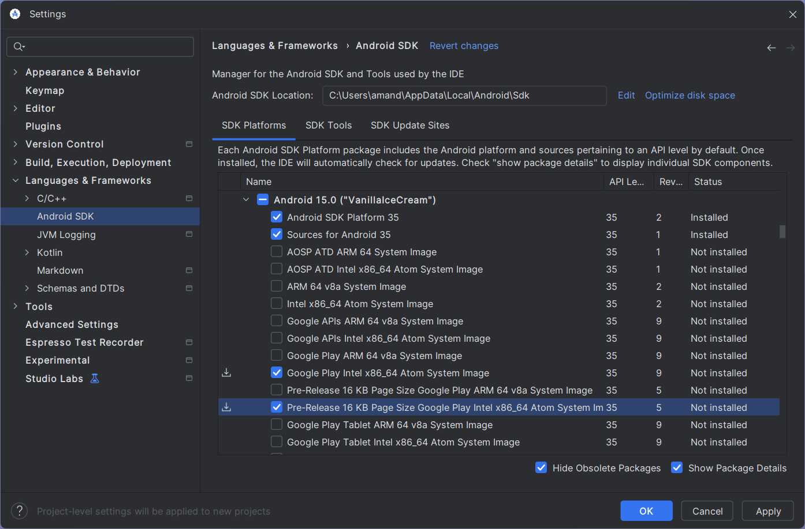
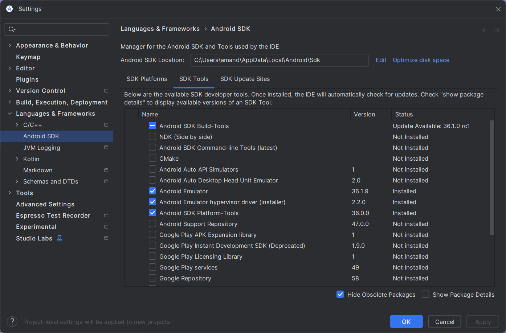
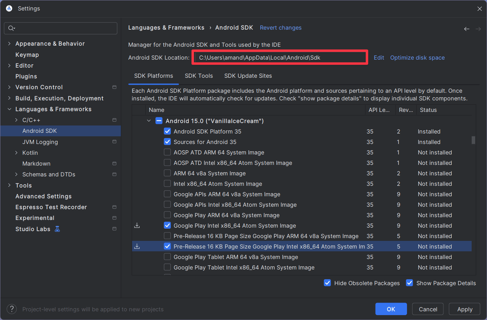

# ⚙️ React Native — Installation & Setup

> A step-by-step guide to setting up your React Native development environment using **Expo** on Windows.

---

## 🛠️ Initial Setup

### Prerequisites
- [Node.js](https://nodejs.org/) installed on your machine

### Create a New Expo Project

```bash
npx create-expo-app@latest --template default@next
```

When prompted, **enter your project name** and let Expo scaffold everything for you.

---

## 📺 How to View & Test Your App

You have two options: run on a **real Android device** or use the **Android Studio Emulator**.

---

### Step 1 — Install Android Studio

Download **Android Studio** (Windows) or **Xcode** (Mac) and follow the official Expo guide:

📖 [Expo Android Studio Emulator Setup](https://docs.expo.dev/workflow/android-studio-emulator/)

---

### Step 2 — Install Java Development Kit (JDK)

Open **PowerShell as Administrator** and run:

```powershell
choco install -y microsoft-openjdk17
```

> ⚠️ You'll need [Chocolatey](https://chocolatey.org/) installed for this command to work.

---

### Step 3 — Configure SDK in Android Studio

Inside Android Studio, go to **More Actions → SDK Manager** and install the following:

**SDK Platforms:**



**SDK Tools:**



---

### Step 4 — Set Environment Variables

1. Open: `Control Panel → User Accounts → User Accounts → Change my environment variables`
2. Click **New** to create a new user variable:

| Variable Name | Value |
|---|---|
| `ANDROID_HOME` | Path to your Android SDK folder |

**How to find your SDK path:**



---

## ▶️ Running the App

### On a Real Android Phone

```bash
cd your-project-name
npx expo start
```

- Install **Expo Go** from the Play Store on your phone.
- Scan the **QR code** displayed in the terminal.

---

### On Android Studio Emulator

```bash
cd your-project-name
npx expo start
```

1. In Android Studio → **More Actions → Virtual Device Manager → Start** your AVD.
2. Back in your terminal / VS Code, press **`a`** to launch the app on the emulator.
3. **BOOM!** 🎉 Your app is live.

---

*You're all set — start building something amazing! 🚀*